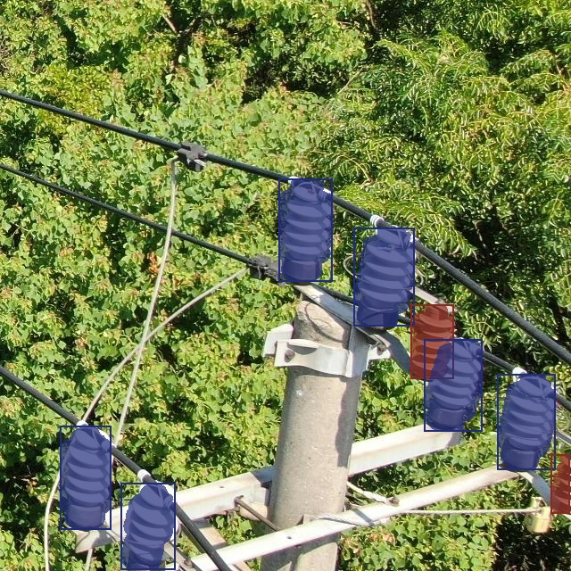
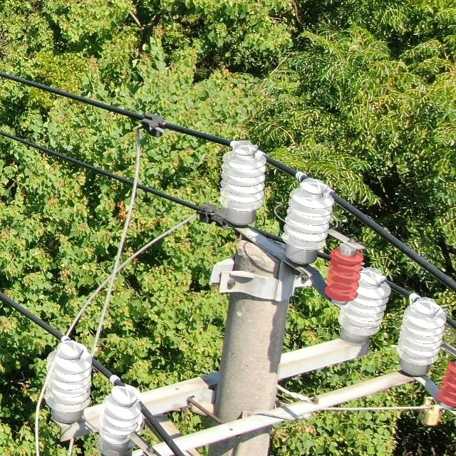
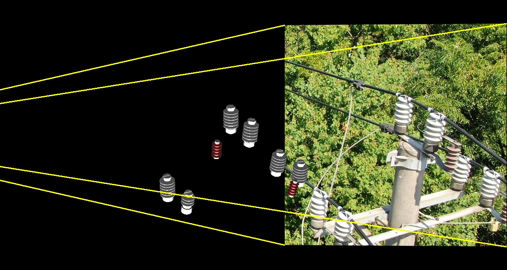
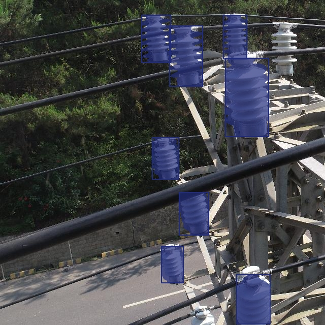
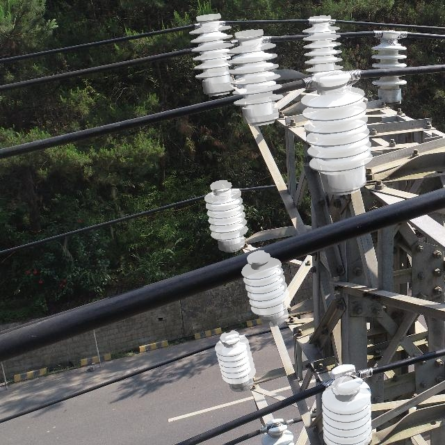
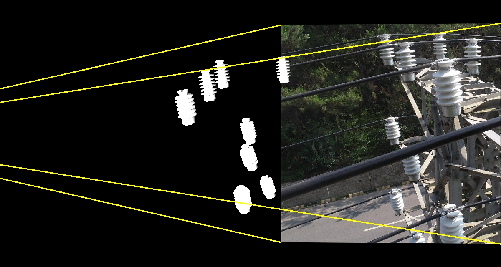

#Unsupervised Monocular 3D Detection of Power Distribution Equipment using Random Rendering and Recovery

This is the open-source project of our paper. 
+ This project contains the necessary codes for the proposed method.
+ The 3D model is released at the folder "dataset - example/wobjs".
+ The weights is released at the folder "weights", including weights of the 3D detector (rrr_res50fpn_pretrain/rrr_res50fpn_random) and the weights for mmdet training (rrr_res50-mmdet/rrr_fpn-mmdet).


 |  | 
---|---|---
 |  | 


## Data Preparation
Folder "dataset" shows the organization of our datasets. 
You can build your own datasets by referring to this form.
```angular2html
dataset root
    |-wobjs
        |-info.json
        |-3D Model 1.obj
        |-3D Model 2.obj
        |-...
    |-images
        |-image1.jpg
        |-image2.jpg
        |-...
    |-labels_tst (Optional)
        |-image1.pkl
        |-image2.pkl
        |-...
    |-train.txt
    |-test.txt

```
We have put some images in folder "images" for demo and visualization.
It is worth noting that "info.json" contains the definition information for the 3D models. 
You need to update this file if you add new 3D models.
If you need to convert the existing VOC annotation to a our pkl annotation, run the following code:
```
python scripts/xml2pkl.py
```
## Infering
By running the following code, you can perform infering in the image folder based on the 3D detector weights.
```
python scripts/infer.py
```
For multiple GPUs, run the following code.
```
CUDA_VISIBLE_DEVICES=0,1,2,3  torchrun --nproc_per_node=4 --nnodes=1 infer.py
```
You can set key parameters directly in this file.
```
img_size = (640, 640)
num_workers = 0
batch_size = 4
root = os.path.join(PROJECT_DIR, 'dataset-example') #Your dataset path
save_pth = os.path.join(PROJECT_DIR, 'weights/rrr_res50fpn_pretrain.pth') #The 3D detector weights
```
You can open the generated pkl file with "pickle" to take advantage of the data or use our visualization methods.
## Visualization
By running the following code, you can draw the labels on the images.
```
python scripts/visual.py
```
The parameter can be set like "infer.py".
## Training
By running the following code, you can train the 3D detector from random initialization.
```
python scripts/train.py
```
The parameter can be set like "infer.py".
## Evaling
By running the following code, you can eval the 3D detector weights.
```
python scripts/eval.py
```
The parameter can be set like "infer.py".

